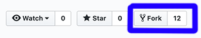

# San Diego Tech Hub Site

This site was developed with [GatsbyJS](https://www.gatsbyjs.org/) and serves as the home page for [San Diego Tech Hub](https://sandiegotechhub.com).

## Contribute

**Working on your first Pull Request?** You can learn how from this _free_ series [How to Contribute to an Open Source Project on GitHub](https://egghead.io/series/how-to-contribute-to-an-open-source-project-on-github)

### System Requirements

- [git](https://git-scm.com/downloads)
- [node](https://nodejs.org/en/download)

### Getting Started

1. Fork the project (this copies the SDTH Website repository to your GitHub account)

2. Clone your fork (copies your GitHub SDTH Website repository to your local computer)

   > `git clone https://github.com/[your-github-username]/sdth-site.git`

3. Confirm you are in the right directory in terminal: `cd sdth-site`

4. Add an `upstream` remote for keeping your local repository up-to-date

   > `git remote add upstream https://github.com/san-diego-tech-hub/sdth-site.git`

5. Run `cp env.default .env.dev`

6. Grab the environment variables from a developer in the [slack channel](https://join.slack.com/t/sandiegotechhub/shared_invite/enQtNTI1MDA2NjQyNDcwLTRhYmFhOGZlNzQyZWQ0NmJjMTEzNGE1YjI1NTJmY2RhZjVmYjBjNDAyYmI4MDZkNTM4MzMwM2JmYWQzOGVkYjY)

7. Run `nvm use` use the version of node identified in `.nvmrc`

8. Run `npm ci` to install the project dependencies

9. Run `npm start` to start your dev environment

### Creating a new pull request

1. Make sure you are on the `development` branch, and you have pulled the latest changes

   > `git checkout development && git pull upstream development`

2. Install any new dependencies: `npm ci`

3. Create a new branch off of the `development` branch

   > `git checkout -b [NEW BRANCH NAME]`

   > **Branch naming conventions:** `fix/[BRANCH]` for bug fixes, `feature/[BRANCH]` for new features, `dev/[BRANCH]` for non-user-facing changes. The `[BRANCH]` portion should be kebab case. For example, if you want to update the README.md file, your branch could be called `dev/update-readme`

4. Make changes and commit them. `git add . && git commit -m "[YOUR COMMIT MESSAGE]"`

   > The subject of a commit message (the first line) should be 72 characters or less. If you need more room for a longer explanation of your changes, you can add a blank line below the subject and write a commit body. The commit message should be in present-imperative tense ("Update README.md" rather than "Updates" or "Updated").

5. Push your branch to your fork: `git push -u origin [BRANCH NAME]`

6. Open a new pull request against the `development` branch from your fork using the GitHub user interface
